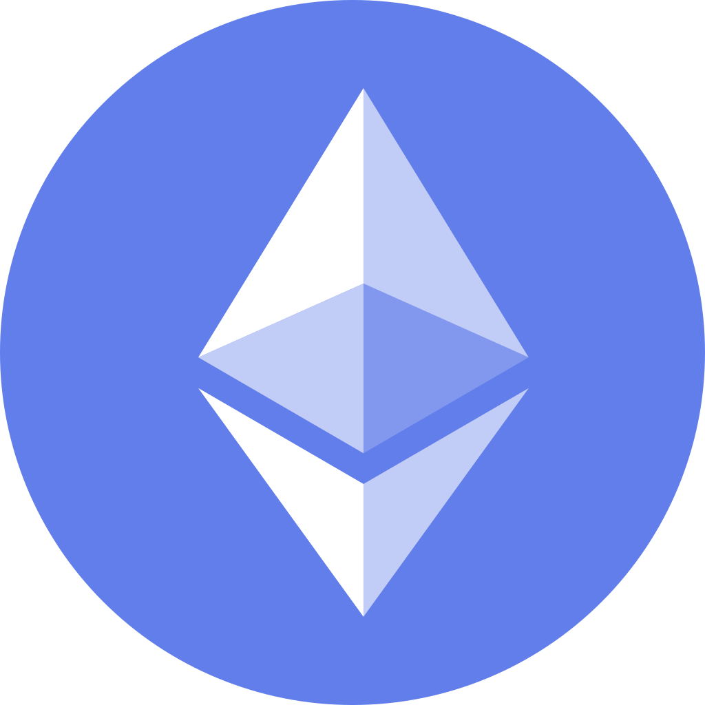

# ⭐️ Smart Contract Wizard | Solana ✦ EVM ✦ Rust ✦ Solidity ⭐️

---

## >>>>>>>>>>>>>>>>>> ✩ About Me ✩ <<<<<<<<<<<<<<<<<<

🚀 I architect secure and scalable smart contracts across **Solana** and **EVM** blockchains.  
🔧 Proficient in **Rust**, **Solidity**, and the **Anchor** framework for seamless dApp deployment.  
🧩 I've built Gamefi, DeFi protocols, NFTs, and DAOs, integrating full-stack smart contract ecosystems.  
🌐 Deep knowledge of Solana’s high-throughput Sealevel runtime and EVM bytecode optimization.  
✨ Cool experience in Fullstack development.

 🛠️Tech Stack

<table align="center">
  <tr>
    <td align="center"> Solana</td>
    <td align="center"> Ethereum</td>
    <td align="center"> Bitcoin</td>
    <td align="center"> Binance</td>
    <td align="center"> Sui</td>
    <td align="center"> Ton</td>
    <td align="center"> Rust</td>
    <td align="center"> Solidity</td>
    <td align="center"> TypeScript</td>
    <td align="center"> JavaScript</td>

  </tr>
  <tr>
    <td align="center"> Next.js</td>
    <td align="center"> Express</td>
    <td align="center"> OpenAI</td>
    <td align="center"> Hugging Face</td>
    <td align="center"> TensorFlow</td>
    <td align="center"> PyTorch</td>
    <td align="center"> Python</td>
    <td align="center"> Node.js</td>
    <td align="center"> React</td>
    <td align="center"> PostgreSQL</td>
  </tr>
</table>

---

*This README showcases expertise across blockchain ecosystems, smart contract languages, fullstack frameworks, and AI toolkits.*

---

**Contact:**  
Feel free to reach out for collaboration or questions!

