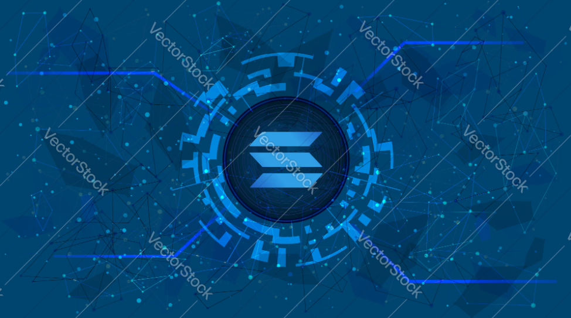

<!-- Background Layer -->

  <!-- Fixed Background Image -->
  

  <!-- Foreground Content Layer -->
  

    
  

  <h2 align="center">⚡ Smart Contract Wizard | Solana ✦ EVM ✦ Rust ✦ Solidity</h2>

  

  ### 🧠 About Me

  🚀 I architect secure and scalable smart contracts across **Solana** and **EVM** blockchains.  
  🔧 Proficient in **Rust**, **Solidity**, and the **Anchor** framework for seamless dApp deployment.  
  📦 Expert in writing gas-efficient, upgradeable contracts using proxy patterns.  
  🧩 I've built DeFi protocols, NFTs, and DAOs, integrating full-stack smart contract ecosystems.  
  🌐 Deep knowledge of Solana’s high-throughput Sealevel runtime and EVM bytecode optimization.  
  🛡️ Security-first mindset: audits, fuzzing, and static analysis are part of my workflow.  
  🔍 Extensive experience with SPL/ERC standards (ERC-20, ERC-721, ERC-1155).  
  🎯 Delivered production-grade dApps that scale and perform under load.  
  🛠️ Passionate about cross-chain bridges, Layer‑2 rollups, and interoperability.  
  🌱 Lifelong learner—continually exploring emerging blockchain paradigms.

  

  ### 🛠️ Tech Stack

  

    
    
    
    
    
    
    
    
  

