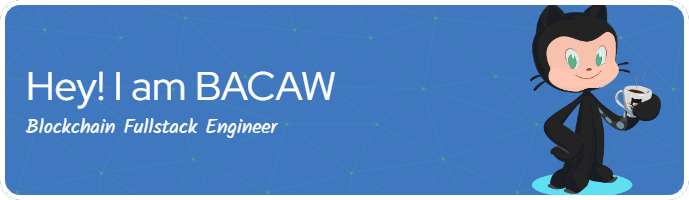

<!-- BANNER WITH TEXT OVER IMAGE -->

  

    
    <h2 style="position: absolute; top: 50%; left: 50%; transform: translate(-50%, -50%);
               font-size: 2em; font-weight: bold; margin: 0; padding: 0;">
      ⚡ Smart Contract Wizard | Solana ✦ EVM ✦ Rust ✦ Solidity
    </h2>
  

---

### 🧠 About Me

🚀 I architect secure and scalable smart contracts across **Solana** and **EVM** blockchains.  
🔧 Proficient in **Rust**, **Solidity**, and the **Anchor** framework for seamless dApp deployment.  
🧩 I've built DeFi protocols, NFTs, and DAOs, integrating full-stack smart contract ecosystems.  
🌐 Deep knowledge of Solana’s high-throughput Sealevel runtime and EVM bytecode optimization.  
✨ Cool experience in Fullstack development.

<h3 align="center">🛠️ Tech Stack</h3>

  
  
  
  

