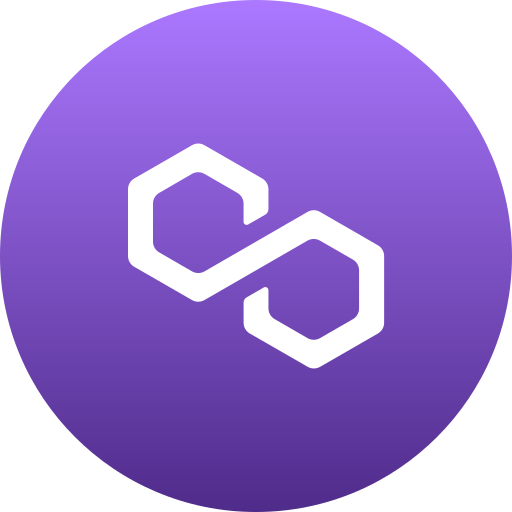

# ⭐️ Smart Contract Wizard | Solana ✦ EVM ✦ Rust ✦ Solidity ⭐️

---

## ✩ About Me ✩

🚀 I architect secure and scalable smart contracts across **Solana** and **EVM** blockchains.  
🔧 Proficient in **Rust**, **Solidity**, and the **Anchor** framework for seamless dApp deployment.  
🧩 I've built DeFi protocols, NFTs, and DAOs, integrating full-stack smart contract ecosystems.  
🌐 Deep knowledge of Solana’s high-throughput Sealevel runtime and EVM bytecode optimization.  
✨ Cool experience in Fullstack development.

---

## 🛠️ Tech Stack

| Blockchain | Languages & Smart Contracts | Frameworks & Fullstack | AI & Toolkits |
|------------|-----------------------------|-----------------------|---------------|
|    Solana |    Rust |    Node.js |    OpenAI |
|    Ethereum |    Solidity |    Express |    DeepSeek |
|    Bitcoin |    JavaScript |    React |    LangChain |
|    Aptos |    TypeScript |    Next.js |    Hugging Face |
|    Polkadot |    Python |    Django |    ElizaOS |
|    Cosmos |    C++ |    Laravel |    TensorFlow |
|    Polygon |    Go |    Angular |    PyTorch |
|    Sui |    PHP |    PostgreSQL |    Ollama |
|  |    Ruby |    MongoDB |    FastAPI |
|  |    Java |    MySQL |    VApi |
|  |    Tron |  |  |
|  |    Ton |  |  |

---

*This README showcases expertise across blockchain ecosystems, smart contract languages, fullstack frameworks, and AI toolkits.*

---

**Contact:**  
Feel free to reach out for collaboration or questions!

